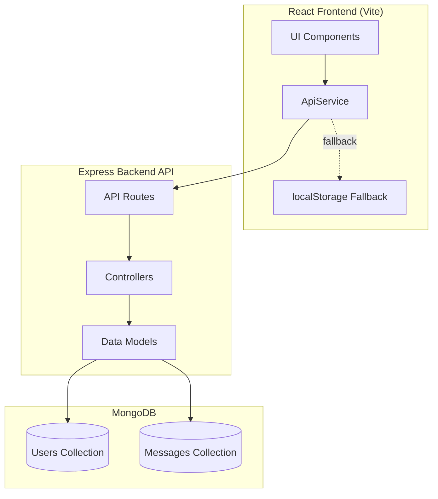

# Design Document: MongoDB Integration

## Overview

This design document outlines the architecture for integrating MongoDB into the Connect real-time messaging application. The solution implements a Node.js/Express backend API that serves as an intermediary between the React frontend and MongoDB database. The design maintains backward compatibility with the existing localStorage fallback mechanism while providing production-ready data persistence.

The integration follows a three-tier architecture: React frontend (presentation layer), Express API (application layer), and MongoDB (data layer). This separation ensures scalability, maintainability, and allows independent deployment of frontend and backend components.

## Architecture

### System Architecture Diagram



### Technology Stack

**Backend:**
- Node.js (v18+) - JavaScript runtime
- Express.js (v4.18+) - Web framework
- MongoDB Node Driver (v6.0+) - Database client
- dotenv - Environment configuration
- cors - Cross-origin resource sharing

**Database:**
- MongoDB (v6.0+) - NoSQL document database
- MongoDB Atlas (recommended) or self-hosted instance


### Deployment Architecture

**Development Environment:**
- Frontend: `npm run dev` on localhost:5173
- Backend: Node server on localhost:3000
- Database: MongoDB Atlas free tier or local MongoDB instance

**Production Environment:**
- Frontend: Static build deployed to Vercel/Netlify
- Backend: Node server deployed to Render/Railway/Heroku
- Database: MongoDB Atlas production cluster

## Components and Interfaces

### Backend Components

#### 1. Database Connection Module (`db.ts`)

Manages MongoDB connection lifecycle and provides database instance to other modules.

```typescript
interface DatabaseConfig {
  uri: string;
  dbName: string;
  options: MongoClientOptions;
}

class DatabaseConnection {
  connect(): Promise<Db>
  disconnect(): Promise<void>
  getDb(): Db
  isConnected(): boolean
}
```

**Responsibilities:**
- Establish connection to MongoDB using connection string
- Implement connection pooling (min: 5, max: 20 connections)
- Handle connection errors with retry logic (5 attempts, 10s interval)
- Provide graceful shutdown on process termination
- Export database instance for use by models


#### 2. User Model (`models/User.ts`)

Handles all user-related database operations.

```typescript
interface UserDocument {
  _id: ObjectId;
  username: string;
  email: string;
  avatar: string;
  status: string;
  lastSeen: number;
}

class UserModel {
  createUser(userData: Partial<User>): Promise<User>
  findUserByEmail(email: string): Promise<User | null>
  getAllUsers(): Promise<User[]>
  updateUser(userId: string, updates: Partial<User>): Promise<User>
  updateLastSeen(userId: string): Promise<void>
}
```

**Responsibilities:**
- Create new user documents with auto-generated ObjectId
- Check for existing users by email before creation
- Retrieve all users for the "universe" view
- Update user profile fields (username, avatar, status)
- Update lastSeen timestamp on user activity
- Transform MongoDB _id to id for frontend compatibility


#### 3. Message Model (`models/Message.ts`)

Handles all message-related database operations.

```typescript
interface MessageDocument {
  _id: ObjectId;
  senderId: string;
  receiverId: string;
  text?: string;
  imageUrl?: string;
  type: 'text' | 'image';
  timestamp: number;
  status: 'sent' | 'delivered' | 'read';
}

class MessageModel {
  createMessage(messageData: Message): Promise<Message>
  getMessagesBetweenUsers(user1Id: string, user2Id: string): Promise<Message[]>
  updateMessageStatus(messageId: string, status: string): Promise<void>
  checkDuplicateMessage(senderId: string, receiverId: string, timestamp: number): Promise<boolean>
}
```

**Responsibilities:**
- Create new message documents with auto-generated ObjectId
- Retrieve messages between two users (bidirectional query)
- Sort messages by timestamp in ascending order
- Update message status (sent → delivered → read)
- Prevent duplicate messages during migration
- Limit query results to most recent 500 messages


#### 4. API Routes (`routes/index.ts`)

Defines RESTful endpoints and maps them to controller functions.

```typescript
// User Routes
POST   /users          - Create or retrieve user
GET    /users          - Get all users
PUT    /users/:id      - Update user profile

// Message Routes
POST   /messages       - Send a message
GET    /messages       - Get messages between two users (query: u1, u2)
PUT    /messages/:id   - Update message status
```

#### 5. Controllers (`controllers/userController.ts`, `controllers/messageController.ts`)

Handle HTTP request/response logic and coordinate with models.

```typescript
class UserController {
  registerUser(req: Request, res: Response): Promise<void>
  getUsers(req: Request, res: Response): Promise<void>
  updateUser(req: Request, res: Response): Promise<void>
}

class MessageController {
  sendMessage(req: Request, res: Response): Promise<void>
  getMessages(req: Request, res: Response): Promise<void>
  updateMessageStatus(req: Request, res: Response): Promise<void>
}
```

**Responsibilities:**
- Validate incoming request data
- Call appropriate model methods
- Handle errors and return appropriate HTTP status codes
- Transform data between API format and database format
- Log requests and errors


#### 6. Server Entry Point (`server.ts`)

Main application file that initializes Express server and middleware.

```typescript
class Server {
  initialize(): Promise<void>
  setupMiddleware(): void
  setupRoutes(): void
  start(port: number): void
  shutdown(): Promise<void>
}
```

**Responsibilities:**
- Load environment variables from .env file
- Initialize database connection
- Configure Express middleware (CORS, JSON parser, logger)
- Register API routes
- Start HTTP server on configured port
- Handle graceful shutdown (close DB connections)

### Frontend Components

#### Updated ApiService (`services/api.ts`)

Enhanced to support backend API with localStorage fallback.

**Key Changes:**
- Add connection detection on app startup
- Implement automatic fallback to localStorage on backend failure
- Add data migration logic for localStorage → backend
- Maintain existing mock mode for offline development

```typescript
class ApiService {
  static async detectBackend(): Promise<boolean>
  static async migrateLocalData(): Promise<void>
  // Existing methods remain unchanged
}
```


## Data Models

### User Collection Schema

```json
{
  "_id": "ObjectId (auto-generated)",
  "username": "string (required, 3-50 chars)",
  "email": "string (required, unique, email format)",
  "avatar": "string (required, URL format)",
  "status": "string (required, max 200 chars)",
  "lastSeen": "number (required, Unix timestamp)"
}
```

**Indexes:**
- `{ email: 1 }` - Unique index for email lookups
- `{ lastSeen: -1 }` - Index for sorting by activity

**Validation Rules:**
- username: required, string, min 3 chars, max 50 chars
- email: required, string, matches email regex
- avatar: required, string, matches URL regex
- status: required, string, max 200 chars
- lastSeen: required, number, positive integer

### Message Collection Schema

```json
{
  "_id": "ObjectId (auto-generated)",
  "senderId": "string (required, references User._id)",
  "receiverId": "string (required, references User._id)",
  "text": "string (optional, max 5000 chars)",
  "imageUrl": "string (optional, URL format)",
  "type": "string (required, enum: ['text', 'image'])",
  "timestamp": "number (required, Unix timestamp)",
  "status": "string (required, enum: ['sent', 'delivered', 'read'])"
}
```

**Indexes:**
- `{ senderId: 1, receiverId: 1, timestamp: 1 }` - Compound index for sender queries
- `{ receiverId: 1, senderId: 1, timestamp: 1 }` - Compound index for receiver queries
- `{ timestamp: -1 }` - Index for sorting by time

**Validation Rules:**
- senderId: required, string, length 24 (ObjectId format)
- receiverId: required, string, length 24 (ObjectId format)
- text: optional, string, max 5000 chars (required if type='text')
- imageUrl: optional, string, URL format (required if type='image')
- type: required, enum ['text', 'image']
- timestamp: required, number, positive integer
- status: required, enum ['sent', 'delivered', 'read']


## Correctness Properties

A property is a characteristic or behavior that should hold true across all valid executions of a system—essentially, a formal statement about what the system should do. Properties serve as the bridge between human-readable specifications and machine-verifiable correctness guarantees.

### Property 1: Connection String Validation

*For any* connection string input, if it does not match the MongoDB URI format (mongodb:// or mongodb+srv://), the validation function should reject it and prevent connection attempts.

**Validates: Requirements 1.5**

### Property 2: User Registration Creates Valid Documents

*For any* valid username and email pair, when a user registers, the Backend_API should create a document in the User_Collection with a unique ObjectId, and all required fields (username, email, avatar, status, lastSeen) should be present and correctly formatted.

**Validates: Requirements 2.1, 2.2, 2.6**

### Property 3: Duplicate Email Prevention

*For any* email that already exists in the User_Collection, attempting to register a new user with that email should return the existing user document without creating a duplicate.

**Validates: Requirements 2.3, 10.4**

### Property 4: User Profile Updates Persist

*For any* existing user and any valid profile updates (username, avatar, or status), after updating the user profile, retrieving that user should return the updated values.

**Validates: Requirements 2.5**

### Property 5: LastSeen Timestamp Updates

*For any* user action (registration, profile update, message send), the user's lastSeen timestamp should be updated to a value greater than or equal to the action timestamp.

**Validates: Requirements 2.7**


### Property 6: Message Creation Completeness

*For any* valid message data (senderId, receiverId, content, type), when a message is created, the Backend_API should generate a unique ObjectId and store a document containing all required fields (senderId, receiverId, text/imageUrl, type, timestamp, status).

**Validates: Requirements 3.1, 3.2, 3.3**

### Property 7: Bidirectional Message Retrieval

*For any* two user IDs (user1, user2), querying messages between them should return all messages where (senderId=user1 AND receiverId=user2) OR (senderId=user2 AND receiverId=user1), regardless of query parameter order.

**Validates: Requirements 3.4**

### Property 8: Message Chronological Ordering

*For any* message query result, the messages should be sorted by timestamp in ascending order (oldest first).

**Validates: Requirements 3.5**

### Property 9: Message Status Updates Persist

*For any* existing message and any valid status value ('sent', 'delivered', 'read'), after updating the message status, retrieving that message should return the updated status.

**Validates: Requirements 3.6**

### Property 10: Message Type Support

*For any* message of type 'text' (with text field) or type 'image' (with imageUrl field), the Backend_API should successfully store and retrieve the message with the correct type and content.

**Validates: Requirements 3.7**

### Property 11: User Endpoint Round Trip

*For any* valid username and email, posting to /users endpoint and then retrieving from /users endpoint should return a user object containing the original username and email.

**Validates: Requirements 4.1, 4.2**

### Property 12: Message Endpoint Round Trip

*For any* valid message object, posting to /messages endpoint and then querying /messages with the sender and receiver IDs should return the message with matching content.

**Validates: Requirements 4.3, 4.4**


### Property 13: Invalid Data Returns 400

*For any* endpoint and any invalid request data (missing required fields, wrong types, invalid formats), the Backend_API should return a 400 status code with an error message describing the validation failure.

**Validates: Requirements 4.5**

### Property 14: User Validation Enforcement

*For any* user document missing required fields (username, email, avatar) or containing invalid data (non-email format, non-URL avatar), the User_Collection should reject the document and the Backend_API should return a validation error.

**Validates: Requirements 5.1, 5.2, 5.3, 5.7**

### Property 15: Message Validation Enforcement

*For any* message document missing required fields (senderId, receiverId, type, timestamp) or containing invalid data (invalid type enum, non-numeric timestamp), the Message_Collection should reject the document and the Backend_API should return a validation error.

**Validates: Requirements 5.4, 5.5, 5.6, 5.7**

### Property 16: Message Query Result Limit

*For any* message query between two users, the result should contain at most 500 messages, even if more messages exist in the database.

**Validates: Requirements 6.5**

### Property 17: Credential Redaction in Logs

*For any* log message or error message, the content should not contain sensitive credentials (passwords, API keys, connection string credentials).

**Validates: Requirements 7.5**

### Property 18: Error Logging Completeness

*For any* database operation error, the Backend_API should create a log entry containing timestamp, operation type, and error details.

**Validates: Requirements 8.1**

### Property 19: Request Logging Completeness

*For any* incoming API request, the Backend_API should create a log entry containing HTTP method, request path, and timestamp.

**Validates: Requirements 8.4**


### Property 20: Frontend Backend Routing

*For any* data operation (user registration, message send, data retrieval), when the Backend_API is available, the Frontend_Service should send the request to the backend endpoint; when unavailable, it should use localStorage.

**Validates: Requirements 9.1, 9.2**

### Property 21: LocalStorage Migration Completeness

*For any* localStorage data (users and messages), when migrating to the backend, all data should be successfully uploaded and then cleared from localStorage to prevent duplication.

**Validates: Requirements 9.4, 10.2, 10.3**

### Property 22: Duplicate Message Prevention

*For any* message with a specific combination of senderId, receiverId, and timestamp, attempting to create a duplicate message should be detected and prevented.

**Validates: Requirements 10.5**

## Error Handling

### Database Connection Errors

**Retry Strategy:**
- Maximum 5 retry attempts
- 10-second delay between retries
- Exponential backoff not required (fixed interval)
- Log each retry attempt with attempt number

**Failure Handling:**
- After 5 failed attempts, log critical error
- Server should not start if database connection fails
- Provide clear error message indicating MongoDB connection issue

### Request Validation Errors

**Client Errors (400):**
- Missing required fields → "Missing required field: {fieldName}"
- Invalid data format → "Invalid format for field: {fieldName}"
- Invalid enum values → "Invalid value for {fieldName}. Must be one of: {validValues}"
- Return JSON error response with `{ error: string, details?: object }`

**Server Errors (500):**
- Database operation failures → "Database operation failed"
- Unexpected errors → "Internal server error"
- Log full error stack trace server-side
- Never expose internal error details to client


### Network Timeout Errors

**Frontend Timeout Handling:**
- 3-second timeout for all backend requests
- Automatic fallback to localStorage on timeout
- User notification: "Using offline mode"
- Retry backend connection on next app launch

**Backend Timeout Handling:**
- MongoDB operation timeout: 5 seconds
- Return 504 Gateway Timeout status
- Log timeout with operation details

### Migration Errors

**Duplicate Handling:**
- Users: Check email before insertion, skip if exists
- Messages: Check senderId + receiverId + timestamp, skip if exists
- Log skipped duplicates for debugging

**Partial Migration Failures:**
- Continue migration even if individual items fail
- Log failed items with error details
- Clear localStorage only after successful migration of all items
- Provide migration summary: {success: number, failed: number, skipped: number}

## Testing Strategy

### Unit Testing

Unit tests will verify specific examples, edge cases, and error conditions for individual functions and modules.

**Test Framework:** Jest (Node.js backend), Vitest (React frontend)

**Backend Unit Tests:**
- Database connection module: test connection success, failure, retry logic
- User model: test CRUD operations with specific examples
- Message model: test CRUD operations with specific examples
- Controllers: test request handling with valid and invalid inputs
- Validation functions: test edge cases (empty strings, null values, boundary values)

**Frontend Unit Tests:**
- ApiService: test backend detection, fallback logic, migration logic
- Test specific scenarios: backend available, backend unavailable, timeout
- Test migration with sample localStorage data

**Coverage Target:** 80% code coverage for critical paths


### Property-Based Testing

Property-based tests will verify universal properties across many randomly generated inputs using fast-check library.

**Test Framework:** fast-check (JavaScript/TypeScript property-based testing library)

**Configuration:**
- Minimum 100 iterations per property test
- Each test tagged with: **Feature: mongodb-integration, Property {number}: {property_text}**

**Property Tests to Implement:**

1. **Connection String Validation (Property 1)**
   - Generate random strings (valid and invalid MongoDB URIs)
   - Verify validation correctly accepts/rejects

2. **User Registration Round Trip (Property 2, 11)**
   - Generate random usernames and emails
   - Verify created user contains all required fields
   - Verify retrieval returns same data

3. **Duplicate Email Prevention (Property 3)**
   - Generate random emails
   - Register user twice with same email
   - Verify only one user exists

4. **User Profile Updates (Property 4)**
   - Generate random user data and updates
   - Verify updates persist correctly

5. **LastSeen Updates (Property 5)**
   - Generate random user actions
   - Verify lastSeen timestamp increases

6. **Message Creation Round Trip (Property 6, 12)**
   - Generate random messages (text and image types)
   - Verify created message contains all required fields
   - Verify retrieval returns same data

7. **Bidirectional Message Retrieval (Property 7)**
   - Generate random user pairs and messages
   - Verify query returns messages in both directions

8. **Message Ordering (Property 8)**
   - Generate random messages with different timestamps
   - Verify results are sorted chronologically

9. **Message Status Updates (Property 9)**
   - Generate random messages and status changes
   - Verify status updates persist

10. **Message Type Support (Property 10)**
    - Generate random text and image messages
    - Verify both types are handled correctly

11. **Invalid Data Rejection (Property 13, 14, 15)**
    - Generate random invalid data (missing fields, wrong types)
    - Verify 400 status code and validation errors

12. **Message Query Limit (Property 16)**
    - Generate more than 500 messages
    - Verify query returns exactly 500

13. **Credential Redaction (Property 17)**
    - Generate random log messages with embedded credentials
    - Verify credentials are redacted

14. **Frontend Routing (Property 20)**
    - Generate random data operations
    - Verify correct routing based on backend availability

15. **Migration Completeness (Property 21)**
    - Generate random localStorage data
    - Verify all data migrates and localStorage clears

16. **Duplicate Message Prevention (Property 22)**
    - Generate messages with same senderId, receiverId, timestamp
    - Verify duplicates are prevented

### Integration Testing

Integration tests will verify end-to-end flows across multiple components.

**Test Scenarios:**
- Complete user registration flow (frontend → backend → database)
- Complete message send flow (frontend → backend → database → retrieval)
- Backend unavailable scenario (frontend fallback to localStorage)
- Migration scenario (localStorage → backend)
- Concurrent user operations (multiple users registering/messaging simultaneously)

**Test Environment:**
- Use MongoDB Memory Server for isolated test database
- Mock network failures for timeout testing
- Use test fixtures for consistent data

### Manual Testing Checklist

- [ ] Deploy backend to staging environment
- [ ] Verify frontend connects to backend successfully
- [ ] Test user registration and login
- [ ] Test sending text messages
- [ ] Test sending image messages
- [ ] Test message history retrieval
- [ ] Test offline mode (disconnect backend)
- [ ] Test migration from localStorage
- [ ] Verify data persists across browser sessions
- [ ] Test with multiple users simultaneously
- [ ] Verify MongoDB Atlas dashboard shows correct data
